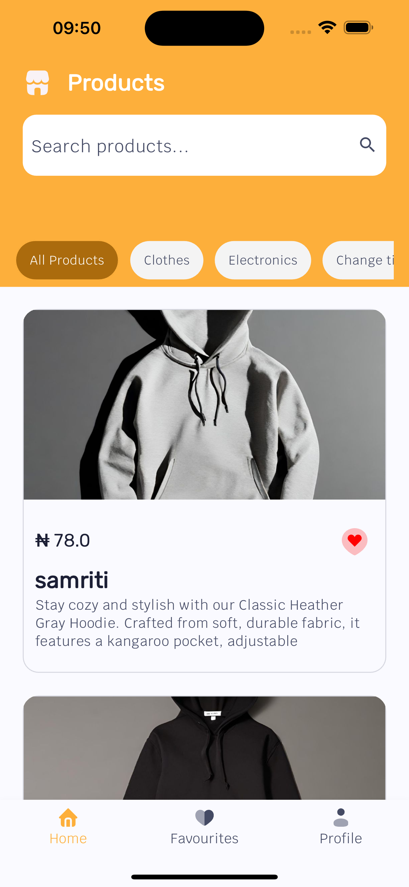
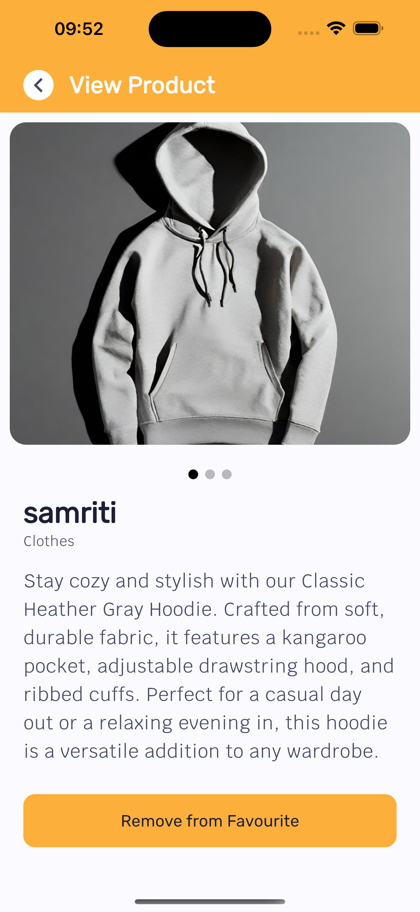
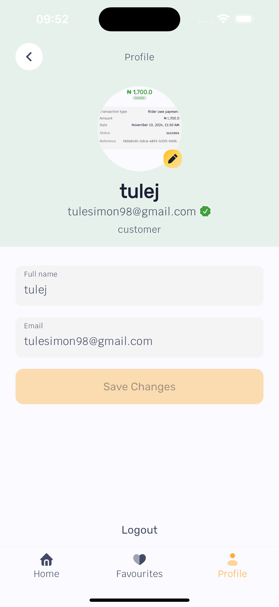

# Tezda Assessment Project

This is an assessment project completed for **Tezda Company**. It was developed using Flutter, with a focus on implementing clean architecture, efficient state management, and responsive design.

---

## Overview

This project demonstrates the use of modern Flutter tools and practices to build a feature-rich and scalable application. The app is styled with **Material Design** and includes functionality such as routing, localization, and state management.

<table>
  <tr>
    <th>Home Screen</th>
    <th>Profile Screen</th>
    <th>Settings Screen</th>
  </tr>
  <tr>
    <td>
      
      <br>
      <b>Home Screen</b>
    </td>
    <td>
      
      <br>
      <b>Profile Screen</b>
    </td>
    <td>
      
      <br>
      <b>Settings Screen</b>
    </td>
  </tr>
</table>

---

## Technologies Used

- **Flutter**: Cross-platform mobile development framework.
- **Flutter Riverpod**: Used for efficient and flexible state management.
- **Get It**: Implemented for dependency injection.
- **Go Router**: Utilized for declarative routing and navigation.
- **Material Theme**: Used for styling, typography, and a consistent UI design.
- **Flutter Localization**: Enabled multi-language support.
- **Equatable**: Simplified equality and data class generation.
- **Flutter SharedPreference** used for storing user data and caching
- **Encryption** AES256 was used for encrypting user data

---

## Features

- **State Management**:
    - Managed application state using **Riverpod**, ensuring reactive and testable code.
- **Dependency Injection**:
    - Integrated **Get It** for service location, enabling loose coupling between components.
- **Routing**:
    - Used **Go Router** for structured and declarative routing.
- **Styling**:
    - Followed **Material Design Guidelines** for a modern and consistent user interface.
- **Localization**:
    - Added support for multiple languages using **Flutter Localization**.
- **Equality and Data Classes**:
    - Used **Equatable** for efficient value comparison and streamlined model creation.
- Aes Encryption
- Caching
- and much more

---

## Challenges Faced

1. **UI Design**:
    - Crafting an intuitive and visually appealing user interface without predefined designs was a significant challenge.
    - Required creative problem-solving to build the UI from scratch.

2. **Time Constraint**:
    - Designing an effective state management pattern and implementing all functionalities within a tight 24-hour deadline.

---

## Getting Started

### Prerequisites

- [Flutter SDK](https://docs.flutter.dev/get-started/install)
- IDE: [Android Studio](https://developer.android.com/studio) or [VS Code](https://code.visualstudio.com/)
- Device or Emulator for testing

### Installation

1. Clone the repository:
   ```bash
   https://github.com/TuleSimon/tezdaassesment.git

    Navigate to the project directory:

    cd tezda-assessment
    Install dependencies:
    
    flutter pub get
    Run the application:
    
    flutter run ```

### Key Components
## State Management
1. Implemented using Riverpod, which provides a robust and reactive architecture for managing app state.
2. Routing
   Used Go Router to handle app navigation efficiently.
3. Dependency Injection
4. Dependency management was handled by Get It, allowing for easy testing and modularity.
5. Styling
6. Followed Material Design principles for consistent theming and typography across the app.
   Localization
7. Integrated Flutter Localization for supporting multiple languages and a global audience.

Acknowledgments
I would like to thank Tezda Company for the opportunity to work on this assessment and for providing a challenging yet rewarding experience.

Author
Simon


